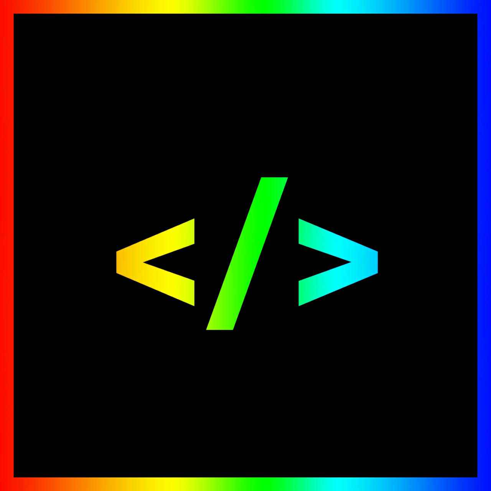

<h1 align="center">Hi everyone! 👋 My name is SlashCoders. 🔰</h1>
<h3 align="center">A passionate frontend developer from Roblox Exploiter Community ♻️</h3>

- 🔭 I’m currently working on [Ro-xploit 6.0](https://github.com/SwitchWatcher/Ro-xploit-6.0)

- 👯 I’m looking to collaborate on [RC7](https://github.com/SwitchWatcher/RC7)

- 🤝 I’m looking for help with [c00lgui](https://github.com/SwitchWatcher/c00lgui)

- 🌱 I’m currently learning **to develop any game hacks on mobile and etc.**

- 👨‍💻 All of my projects are available [here](https://github.com/SwitchWatcher?tab=repositories)

- 📝 I regularly write Roblox scripts on [my pastebin](https://pastebin.com/u/SlashCoders)

- 💬 Ask me about **Roblox Script, Cheat & etc.**

- ➡️ My old platform [discord server community](https://discord.gg/vTvyP3nU2X)

- 💻 Facts about me **I'm a decal bypasser on roblox**

<h3 align="left">Connect with me:</h3>

<h3 align="left">Languages and Tools:</h3>

            

&nbsp;

